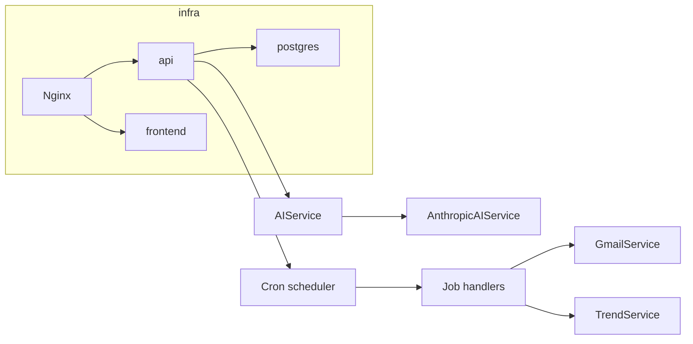

# Infrastructure and Backend Refactor Plan

Execute in order: Docker/infrastructure first, then backend code, then tests.

---

## Phase 1: Infrastructure (Docker and config)

### 1.1 Remove LocalStack

- **[docker-compose.yml](docker-compose.yml)**  
  - Delete the entire `localstack` service block (lines 54–85).  
  - Remove `localstack` from `api.depends_on` (keep `postgres` only).  
  - Remove the five AWS/LocalStack env vars from the `api` service: `AWS_REGION`, `AWS_ACCESS_KEY_ID`, `AWS_SECRET_ACCESS_KEY`, `AWS_ENDPOINT_URL`, `USE_LOCALSTACK`.  
  - Remove the `localstack_data` volume from the `volumes` section.  
  - Update file header comment to describe 3 services (postgres, api, frontend) and remove LocalStack references.

- **Delete** [scripts/localstack-init.sh](scripts/localstack-init.sh).

- **Environment and docs**  
  - In [.env.example](.env.example): remove or comment out `USE_LOCALSTACK`, `AWS_ENDPOINT_URL`, and any other LocalStack/AWS placeholder.  
  - In [README.md](README.md): remove or update the line that references `localstack-init.sh`.

- **Terraform**  
  - In [terraform/main.tf](terraform/main.tf): remove `USE_LOCALSTACK` from the API ECS task environment (line ~210). Optionally add a short comment that this stack is for reference/legacy and VPS is the target.

- **Shared types**  
  - In [libs/shared/src/lib/types.ts](libs/shared/src/lib/types.ts): remove or deprecate `AwsConfig` (and `useLocalStack`). If anything imports it, remove those imports or replace with a minimal type only if still needed.

### 1.2 Add Nginx reverse proxy

- **New file: `nginx/nginx.conf`** (or `config/nginx.conf` at repo root)  
  - Define an `upstream` for API (e.g. `api:3000`) and one for frontend (e.g. `frontend:4200`).  
  - `server` on port 80:  
    - Location `/api` (or `/api/`) proxy to API upstream; preserve `Host` and `X-Real-IP`; optional proxy timeouts.  
    - Location `/` proxy to frontend upstream (for Next.js).  
  - Keep config minimal and suitable for a single VPS.

- **[docker-compose.yml](docker-compose.yml)**  
  - Add service `nginx`: image `nginx:alpine`, ports `80:80`, mount the new `nginx.conf` (e.g. to `/etc/nginx/conf.d/default.conf` or replace default).  
  - `depends_on`: `api`, `frontend`.  
  - Optional: stop exposing `api` and `frontend` ports to the host so all traffic goes through Nginx (recommended for “single entrypoint” VPS).

- **Frontend API URL**  
  - Ensure `NEXT_PUBLIC_API_URL` works behind Nginx (e.g. same host, path `/api`). In compose, set it to `http://nginx/api` or the same hostname the browser uses so requests hit Nginx.

---

## Phase 2: Backend – AI service (model-agnostic)

### 2.1 Define AIService interface and types

- **New file: `api/src/services/ai/types.ts`** (or under a single `ai/` folder)  
  - Export an interface `AIService` with:  
    - `analyzeEmail(email: Email): Promise<EmailSummary>`  
    - `chatCompletion(options: { messages: Array<{ role; content }>; response_format?: { type: 'json_object' | 'text' }; model?: string }): Promise<{ choices: Array<{ message: { content?: string } }> }>`  
  - Use existing shared types `Email`, `EmailSummary` from `@email-whatsapp-bridge/shared`.  
  - Keep the contract identical to current usage so routes and TrendService need no behavior change.

### 2.2 Implement Anthropic provider (default)

- **New file: `api/src/services/ai/anthropic.service.ts`**  
  - Implement `AIService`:  
    - `analyzeEmail`: build prompt from email fields, call Anthropic Messages API with strict output (e.g. structured JSON or tool use), parse into `EmailSummary` (reuse Zod schema from current openai.service or move to shared).  
    - `chatCompletion`: map to Anthropic Messages API; return shape compatible with existing `{ choices: [{ message: { content } }] }` so trend and blogs need no change.  
  - Use `ANTHROPIC_API_KEY` and a default model (e.g. `claude-3-5-sonnet` or latest).  
  - Handle errors and fallbacks similarly to current openai.service (e.g. fallback `EmailSummary` on failure).

- **Environment**  
  - Document `ANTHROPIC_API_KEY` in `.env.example`.  
  - Add dependency: `@anthropic-ai/sdk` in [api/package.json](api/package.json).

### 2.3 Wire AI provider in app and routes

- **Factory or DI**  
  - In a small module (e.g. `api/src/services/ai/index.ts` or `api/src/app/plugins/ai.ts`): read `AI_PROVIDER` or `ANTHROPIC_API_KEY` and instantiate `AnthropicAIService` as default. Export a singleton or a function that returns the same `AIService` instance.

- **Replace OpenAI usage**  
  - [api/src/app/routes/emails.ts](api/src/app/routes/emails.ts): remove `OpenAIService` import and `new OpenAIService()`; use the shared `AIService` instance (e.g. `getAIService().analyzeEmail(email)`).  
  - [api/src/app/routes/blogs.ts](api/src/app/routes/blogs.ts): same — use `AIService.chatCompletion` instead of `OpenAIService`.  
  - [api/src/services/trend.service.ts](api/src/services/trend.service.ts): constructor should accept `AIService` (interface) instead of `OpenAIService`; call `chatCompletion` on that.  
  - Where `TrendService` is instantiated (e.g. blogs route), pass the same `AIService` instance.

- **Cleanup**  
  - Remove or archive [api/src/services/openai.service.ts](api/src/services/openai.service.ts). Optionally keep an `OpenAIAIService` adapter implementing `AIService` in a separate file if you want to support OpenAI as a second provider later; otherwise remove `openai` from api dependencies.

---

## Phase 3: Backend – Cron jobs

### 3.1 Choose and register scheduler

- **Library**  
  - Prefer **`@fastify/schedule`** or **`fastify-cron`** if they support Fastify 5; otherwise **`node-cron`** with manual registration and Fastify lifecycle (e.g. `fastify.addHook('onClose', ...)` to clear cron jobs).

- **[api/package.json](api/package.json)**  
  - Add the chosen cron dependency.

- **[api/src/app/app.ts](api/src/app/app.ts)**  
  - Register the cron plugin or create a wrapper that:  
    - Schedules one or more jobs (e.g. “sync emails” daily, “trend scouting” every 6h — exact schedules TBD).  
    - Runs in the same process as the API; no separate worker for now.  
  - On Fastify close, stop all scheduled jobs so the process exits cleanly.

### 3.2 Define initial jobs (stubs)

- Create a small module (e.g. `api/src/jobs/index.ts` or under `api/src/app/plugins/`) that:  
  - Defines job handlers (e.g. `runEmailSync()`, `runTrendScout()`) that call existing services (GmailService, TrendService, etc.) with appropriate scoping (e.g. all users with tokens, or a system user).  
  - Register these with the scheduler from 3.1.  
  - Keep handlers thin; detail (e.g. “fetch trends and store in DB”) can be added incrementally.

- No need to implement full business logic in this plan; the goal is a working cron integration and clear extension points.

---

## Phase 4: Backend tests

### 4.1 Test setup for API project

- **Jest for `api`**  
  - Ensure the `api` Nx project has a `test` target (e.g. in [api/package.json](api/package.json) or [nx project config](package.json)). Use the same Jest preset as the rest of the repo ([jest.preset.js](jest.preset.js)).  
  - Config: Node environment, path to `api/src`, coverage or test match pattern (e.g. `**/*.spec.ts`, `**/*.test.ts`).

### 4.2 Unit tests for services

- **GmailService**  
  - Mock Google APIs (e.g. `googleapis` or fetch); test: list emails returns expected shape, error when tokens missing or API fails.

- **TrendService**  
  - Inject a mock `AIService`:  
    - `chatCompletion` returns a fixed `{ choices: [{ message: { content: '{"relevant_stories":[...]}' } }] }`.  
  - Test: `findNewTopics()` parses response and returns `relevant_stories`; empty/failed AI response yields empty array.

- **TwilioService**  
  - Mock Twilio client; test: send WhatsApp message calls client with correct args; handle errors (e.g. invalid number).

- **AI service (Anthropic)**  
  - Mock `@anthropic-ai/sdk`; test: `analyzeEmail` returns valid `EmailSummary` for a stub email; `chatCompletion` returns the expected `{ choices }` shape.  
  - Optional: test fallback behavior when API throws.

- **Trello service** (if in scope)  
  - Same idea: mock HTTP or Trello client; test createCard or key methods.

- **Placement**  
  - Co-locate tests: e.g. `api/src/services/gmail.service.spec.ts`, `trend.service.spec.ts`, `twilio.service.spec.ts`, and under `api/src/services/ai/anthropic.service.spec.ts`.

### 4.3 Running tests

- Add/use Nx command: `nx test api` (or `npx jest api/...`) so CI and developers can run API unit tests reliably.

---

## Dependency overview

---

## Order of implementation (checklist)

1. LocalStack removal (docker-compose, script delete, .env.example, README, terraform, shared types).  
2. Nginx: add config file and nginx service in docker-compose; adjust frontend API URL if needed.  
3. AI: add `AIService` interface and types; implement Anthropic provider; add factory/DI; switch routes and TrendService to `AIService`; remove or optionalize OpenAI.  
4. Cron: add dependency; register in app.ts; define job stubs and wire to scheduler; ensure onClose cleanup.  
5. Tests: ensure api test target; add unit tests for Gmail, Trend, Twilio, Anthropic AI (and optionally Trello); verify `nx test api`.